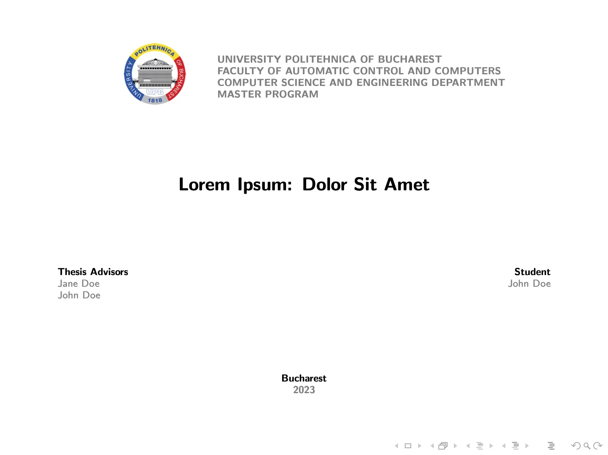

# Presentation Template for Master's Thesis

## Description

This folder offers a LaTex template that you can use to present your master's thesis.

It is intended to provide the LaTeX primitives that can be used to create these types of presentations, rather than to advocate a specific content structure. Please review [this website](https://wiki.cs.pub.ro/studenti/diploma/indicatii#realizare-slide-uri-pentru-sustinereprezentare)'s suggestions for the latter.

Only `configuration.tex` and the files in the `frames` and `images` folders are intended to be altered. Feel free to make changes to any file if you wish to further tweak the theme!

## How To Use

1. Import the `project` folder into Overleaf.
2. Change `configuration.tex` with your details.
3. Create new sections with slides in the `frames/sections` folder, eventually by using the components provided as an example in `frames/sections/examples.tex`. After creating a new section, create a new `\include{<path_to_latex_file>}` macro in `frames/sections/_all.tex`.
4. When finishing the content creation, remove `,handout` from `main.tex`'s first line to enable the transitions.
5. In `frames/sections/_all.tex`, remove the `\include` macro that references `examples.tex`. The latter file can be removed as well.

## Preview

<a href="export.pdf">
    <kbd>
        
    </kbd>
</a>

## Contact

Please drop an email to `hi@iosifache.me` if you have any questions.
