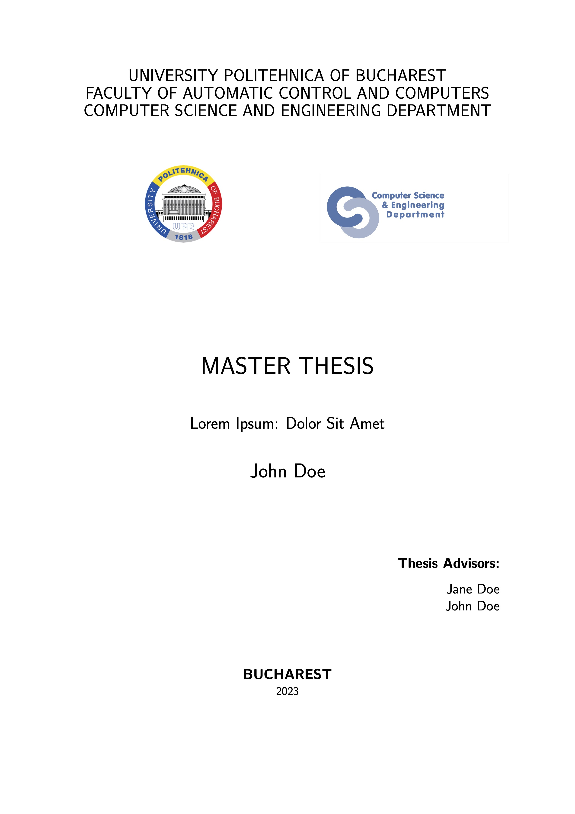

# Master's Thesis Template

## Description

This folder contains a LaTex template for writing a master's thesis.

It is intended to provide the LaTeX primitives that can be used to create these types of presentations, rather than to advocate a specific content structure. Please review [this website](https://wiki.cs.pub.ro/studenti/diploma/indicatii#indicatii-pentru-realizarea-proiectului-de-diploma)'s suggestions for the latter.

## How To Use

1. Import the `project` folder into Overleaf.
2. Change `configuration/details.tex` with your details.
3. Create new chapters in the `chapters` folder, eventually by using the components provided as an example in `chapters/examples.tex`. After creating a new chapter, create a new `\subfile{<path_to_latex_file>}` macro in `chapters/_all.tex`. When writing the content, please consider that some work can be done in parallel:
   - Adding acronyms in `configuration/details.tex`;
   - Adding concepts in `configuration/terms.tex`;
   - Referencing papers, articles, websites, etc. in `configuration/bibliography.bib`; and
   - Avoiding hyphenation for specific words by registering them in `configuration/whole_words.tex`.
4. When finishing the content creation, remove the `\subfile` macro that references `examples.tex` in `chapters/_all.tex`. The latter file can be removed as well.

## Preview

<a href="export.pdf">
    <kbd>
        
    </kbd>
</a>

## Contact

Please drop an email to `hi@iosifache.me` if you have any questions.
